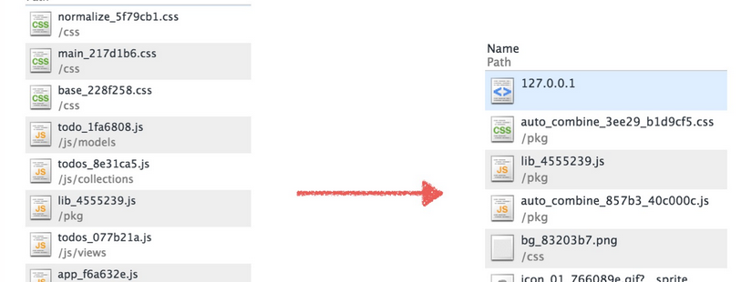

# 静态资源零配置自动合并方案


## 前言

本项目探讨 **代码静态分析** 和 **统计动态合并** 的两种静态资源零配置自动合并方案，重点介绍了复杂项目场景下基于统计的自动合并的原理和实施过程。模块核心接口适用于任意前端项目。

## 需求背景

在上线前进行资源合并已经成为前端开发的共识，一般通过添加合并配置来实现资源的合并。例如最简单粗暴的`将所有css和js分别合并成一个文件`。但这样可能导致页面中加载了很多冗余或废弃的资源，如果按页面去配置又得需要人工去筛选资源。

**有没有即不需要人工配置又能解决冗余资源的合并方式呢？**

**自动合并**  (也叫自动打包)就这样出现了，我们对自动合并可能有以下几种基本需求：

### 自动收集页面中的资源并合并

例如下图所示，自动打包插件将分析页面中的外链资源以及依赖，将资源替换成合并后的包。



与之类似的还有自动收集页面中零散的js和样式等

### 自动调整打包资源输出位置

为了符合性能优化的准则，一般建议将`css放在顶部，js放在底部`，因此我们希望自动合并的时候也能将资源自动按照性能优化规则输出。


### 支持模块化加载框架

前端项目中普遍使用了requreJs、modjs等加载器，自动合并的时候需要保证合并后的资源支持已有的模块化加载框架，并且支持相关依赖的分析加载等。


### 支持复杂页面的性能优化

这可能是稍微特殊的使用场景了，即页面使用了比较多的资源、并且资源的调用场景是动态的(如不同用户看到的页面有差异)。这种情况下如何同时解决人工和性能优化的问题。


## 目前方案

目前主要有**代码静态分析**和**线上动态统计**两种方式解决自动合并的需求。代码静态分析又有不同的使用场景，例如纯前端项目、与后端模板结合、与combo结合等。代码静态分析是使用比较广的方案。

### 纯前端静态分析合并

FIS2&3中都有对应的自动合并插件来实现前端静态分析合并，主要的原理都是分析代码中的js、css代码以及其依赖，按照一定的规则替换成打包后的资源。

**FIS2 fis-postpackager-simple 插件**

在FIS2中simple插件可以自动打包页面零散资源，也可以在前端项目中自动将页面链接替换成用户定义的打包配置资源。支持自定义的打包策略，适用于较简单的纯前端项目中的资源自动管理。

具体可以参考插件文档 https://github.com/hefangshi/fis-postpackager-simple


**FIS3 fis3-postpackager-loader 插件**

FIS3中将纯前端的自动合并的功能进一步增强，不仅支持资源收集打包、指定位置输出，并且支持CommonJS、AMD等模块化加载框架，在纯前端项目中试用范围更广。

具体可以参考文档 https://github.com/fex-team/fis3-postpackager-loader

注意：纯前端代码分析一般是按照页面来收集资源，但对于多个页面共有的资源可以按照简单的规则进行处理。FIS默认不允许一个资源打在多个包内，虽然可以实现，但这样会造成资源的冗余和寻包的困难。

### 与后端模板结合的代码分析

上面提到的两个插件都是针对前端项目的，但FIS有许多与后端语言结合的解决方案，上述插件并未识别模板语言。FIS插件中同样有针对smarty、velocity等模板代码的分析插件，并实现自动合并的工作。

**fis-packager-autopack** 插件的简版模式便能实现后端模板的分析合并需求(由于调用了内部服务，暂时只能在度厂内使用)。

### 与Combo结合的代码分析合并

基于代码扫描的方式很容易跟combo服务结合，因为代码分析过程中已经获取了这个页面引用和依赖的所有资源，只需要将资源选择一种方式输出即可，可以使用上面的新的合并包输出，也可以用combo的方式输出(需要内部有combo服务支持)。

### 与统计结合的资源动态分析合并

上面提到的都是基于代码的静态分析，静态分析有一个明显的缺点就是**无法预知资源的实际使用情况**。例如代码中`if else` 逻辑，或者需要在特定操作下才触发加载的异步资源。页面展现是动态的、资源使用情况也是动态的，这时候如果仅仅按照页面级别合并所有资源可能造成一定的冗余，造成首屏时间和可操作时间的变长。

为了解决这个问题，可以通过统计来获取不同情况下用户使用的资源情况。例如地图这样的富应用页面，项目中包括了大量的JS等资源，页面中也有不同的功能。结合统计可以精确知道用户同步(页面加载)和异步操作下


## 优缺点分析

两种方式的优缺点对比如下：

| 类别 | 优点 | 缺点 | 
|---|---|---|
| 代码静态分析 | 节省人力、自动排除废弃资源、实施方便、插件化 | 无法根据资源实际使用打包 |
| 统计动态分析 | 节省人力、自动排除冗余资源、适应复杂使用场景 | 依赖统计和代码分析，部署难度大 |

无论使用哪种方式都应该满足基本的两点：`能提高研发效率(运行自动化)、能无缝接入现有工作流(编译插件化)`。实际使用中代码静态分析也许解决了大部分的需求，但在一些复杂场景下，基于统计的动态分析更有优势。这也是本项目介绍的重点。

## 基于统计的自动合并方案

### 使用场景

页面使用资源较多、不同的资源组合(页面形态)多、对性能要求高的情况

### 使用效果

除了自动合并资源和自动排除废弃资源，此方案合并文件有如下特点：

 - 大部分页面单独使用的资源将分开合并
 - 大部分页面共同使用到的资源将合并到一起
 - 部分页面共用的资源将根据资源使用次数、资源大小等因素动态计算合并

前面两个特点是比较好理解的，项目的多个页面中，如果资源只在单个页面中使用到，那么将这些资源单独打包可以避免其他页面也加载这些资源造成冗余，而公共资源进行合并则可以整体上减少网站请求。

比较特殊的是第三种情况，即有些资源只在部分页面(情况)下用到，这些资源该如何进行合并呢？如果不合并便会导致请求数增加、如果合并则必然对部分页面造成冗余，在项目较大的情况下两种情况的影响都是比较明显的。如何动态计算实现请求数与页面冗余资源的平衡呢？下面来详细介绍下其中的计算原理。

### 算法原理

算法的核心就在于把是否合并两个文件的判断都统一到时间维度的计算，例如多个请求造成的RTT时间的损耗、以及合并多个资源造成部分页面冗余资源的下载损耗。整个模型是一个收益损失模型，目的在于计算整站多个页面的资源合并最优配置。

关于算法的详细介绍可以参考[此文档](doc/autopack.pdf)


### 日志统计和分析

基于统计的自动合并的核心就是统计整站各个页面的资源使用情况，因此只要能获取到这些数据即可，统计方式不限。一些注意点和说明可以参考[文档](log)


### 配置API

autopack-kernel提供了pack方式供计算自动打包配置所用，配置说明如下：

**platform**

pc/mobile, 不同的终端计算的rtt时间和speed下载速率不同，你也可以手动进行这些参数的配置，默认是mobile


**rtt**

数值，单位秒。http请求一个来回的时间，这是个抽象值。在计算过程中，rtt时间越短，打包越可能忽略请求数的影响(即打包个数可能会更多，因为多建立一个连接的代价是更小的)。

默认是1s,pc端的值默认是0.5s，可以自行配置。

**speed**

数值，单位KB/s。计算一个资源要下载花去的时间的抽象值，这个数值越大，打包越可能忽略冗余资源带来的影响(即打包个数可能会更少，因为页面即使有冗余资源下载的时间代价也很小)。

移动端默认10，pc端默认是100，可以根据需求自行定义。


**types**

需要计算自动打包配置的资源类型，默认是js和css(less文件也属于css)。实际使用中如果css不想进行自动打包，可以在配置中去除css。例如

```
var autoPackger = require('autopack-kernal');
var files = ... ; //资源列表
var result = autoPackger.pack(files,{
    'types' : ['js']
});

```

**partKeys**

资源打包分组依据，如是否将同步异步加载的资源分开打包，是否将资源按照优先级分开打包等。默认按照同步异步分开打包，如果想不区分，在配置中配置空数组即可。

```
var autoPackger = require('autopack-kernal');
var files = ... ; //资源列表
var result = autoPackger.pack(files,{
    'partKeys' : []
});

```

**defaultPack**

自定义打包配置，如果想针对某些特殊资源添加白名单，按照自己配置的资源进行打包，那么添加defaultPack属性即可。如：

```
var autoPackger = require('autopack-kernal');
var files = ... ; //资源列表
var result = autoPackger.pack(files,{
    'defaultPack' : {
        'pkg/custom.js' : [
            '/static/fileB.js'
        ]
    }
});

```

**baseResources**

基础资源配置，数组，这些资源一般是需要优先加载的框架级别资源等。如果配置了此属性，打包结果将按照配置的资源和顺序将和成包内的这些资源放在最前面。如：

```js
var autoPackger = require('autopack-kernal');
var files= ... ;
var result = autoPackger.pack(files,{
    'baseResources' : ['require.js','/static/lib/jquery.js'] //可以写全路径或者文件名
});

```

打包结果中如果包内包含require.js和jquery.js，就会将这两个资源放在最前面。


#### file说明

计算打包的资源file说明如下

 - id : 资源标示ID，一般推荐有`模块：路径`组成，必填参数
 - type: 资源类型，js/css，必填参数
 - url: 资源被使用的页面或者url,可选，不参与计算
 - deps: 资源的**同步依赖**资源数组，里面由资源id组成，可选
 - pages: 资源在各个组合情况下(组合hash)的pv，必填
 - pv: 资源使用总pv，必填
 - size: 资源大小，单位KB，必填
 - priority：资源优先级，1开始，越小优先级越高，可选

只要能获取符合要求的资源列表，就可以调用方法获取自动打包的配置结果，具体可参看此[示例](./test/pack.js)

### 插件支持

[fis3-prepackager-autopack]()


